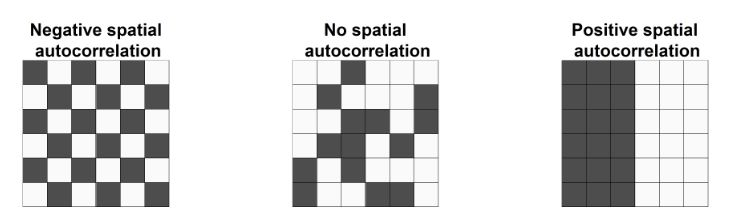

# Introducción a GIT
## Sección 1
Esta es la sección 1
```julia
x = 1:10
y = exp.(x)
lines(x,y)
```
## Sección 2
Esta es la sección 2

## Sección 3
# Esto es una tabla
|Id|Profesion|Age|
|:------------- |:---------------:| -------------:|
|1|Statistician|25|
|2|Writer|32|
## Sección 4
# Enlaces e imagenes
El enlace para este repositorio es [Mi repositorio](https://github.com/OscarCutipaLuque/Prueba).

Ahora agrego una imagen de estadística Espacial.

